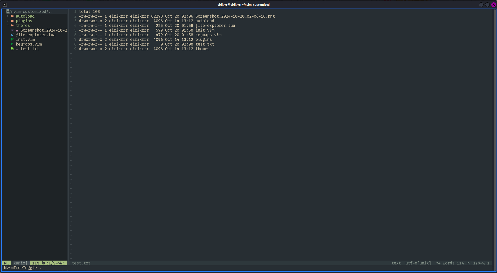

# Nvim IDLE Python

### Resumen

Customizando mi editor de texto NVIM para volverlo un IDLE de Python:
- Theme -> Everforest
- Keymaps -> Shortcuts mas comunes.
- Icons & Fonts -> NerdFont
- File Explorer -> nvimtree + Telescope
- LSP -> Pyright (en proceso de implementar)

 

